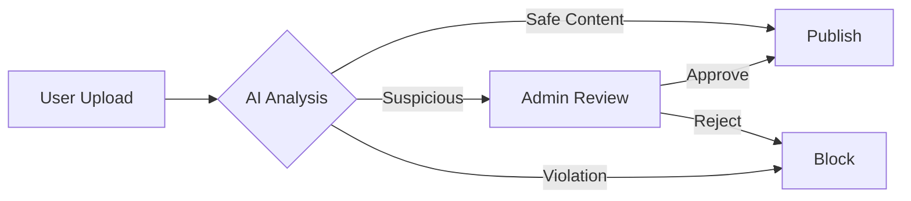
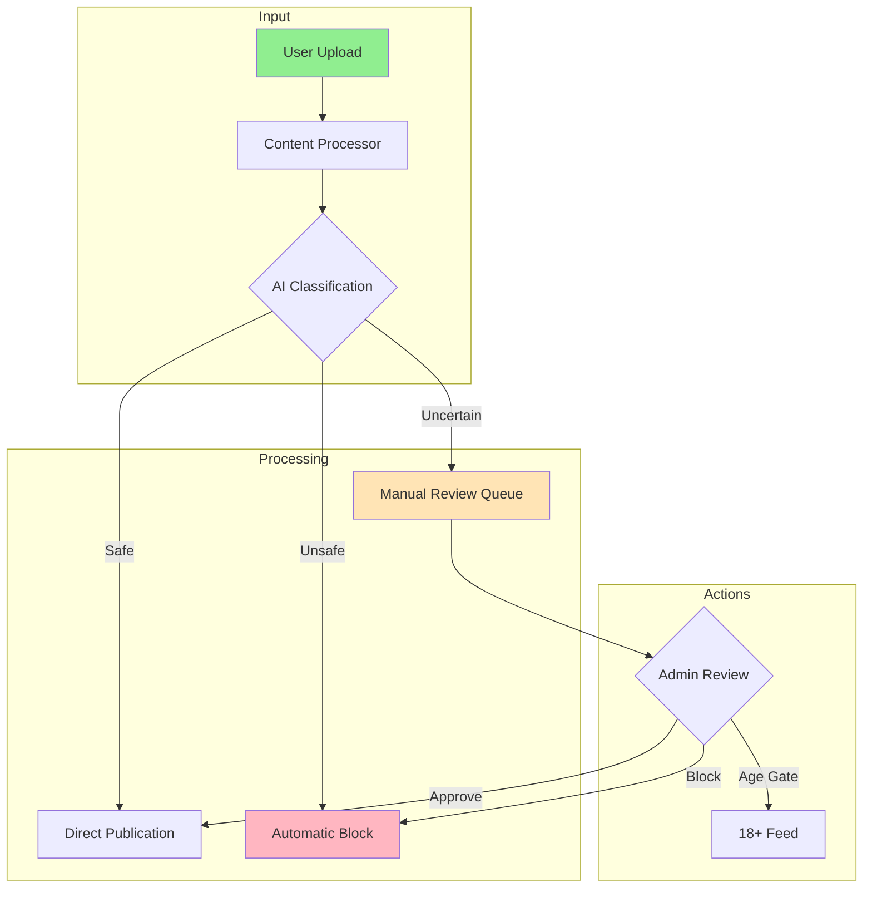
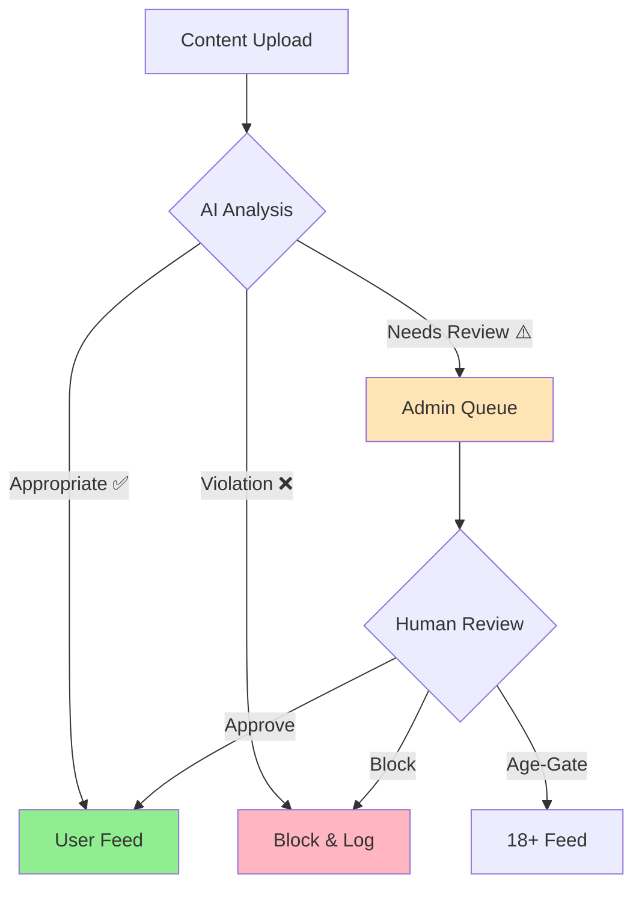

<p align="center">
  
</p>

<div align="center">

```
██╗  ██╗██╗   ██╗███╗   ██╗███████╗██████╗ ███████╗ ██████╗████████╗ ██████╗ ██████╗ 
██║ ██╔╝╚██╗ ██╔╝████╗  ██║██╔════╝██╔══██╗██╔════╝██╔════╝╚══██╔══╝██╔═══██╗██╔══██╗
█████╔╝  ╚████╔╝ ██╔██╗ ██║███████╗██████╔╝█████╗  ██║        ██║   ██║   ██║██████╔╝
██╔═██╗   ╚██╔╝  ██║╚██╗██║╚════██║██╔═══╝ ██╔══╝  ██║        ██║   ██║   ██║██╔══██╗
██║  ██╗   ██║   ██║ ╚████║███████║██║     ███████╗╚██████╗   ██║   ╚██████╔╝██║  ██║
╚═╝  ╚═╝   ╚═╝   ╚═╝  ╚═══╝╚══════╝╚═╝     ╚══════╝ ╚═════╝   ╚═╝    ╚═════╝ ╚═╝  ╚═╝
```

[](https://github.com)
[](https://github.com)
[](https://github.com)

# Intelligent Content Moderation for the Digital Age

*Protecting Communities, Empowering Users, Ensuring Trust*

</div>

## 🛡️ Project Overview

KYNSPECTOR is a cutting-edge AI-powered content moderation platform that safeguards digital communities through intelligent content analysis and automated filtering. Our system processes text, images, and videos in real-time, ensuring your platform remains safe, trustworthy, and compliant with community guidelines.

### 🎯 Key Capabilities

<table>
<tr>
<td width="33%">
<h3 align="center">🤖 Smart Detection</h3>
<p align="center">AI-powered analysis of text, images, and videos with contextual understanding</p>
</td>
<td width="33%">
<h3 align="center">⚡ Real-Time Protection</h3>
<p align="center">Instant content filtering and automatic violation detection</p>
</td>
<td width="33%">
<h3 align="center">🌐 Cultural Intelligence</h3>
<p align="center">Multi-language support with focus on Indian regional languages</p>
</td>
</tr>
</table>

## 🔄 Content Moderation Flow



<div align="center">

### "Building Trust Through Intelligent Content Protection"

[Get Started →](https://github.com) • [Documentation](https://github.com) • [API Reference](https://github.com)

</div>

---

## 🔍 Content Classification

The system uses advanced AI to classify content into three categories:

```
Confidence Score
│
├─── 0.0 to 0.2 ──── Safe Content (✅ Automatic Approval)
│
├─── 0.2 to 0.4 ──── Needs Review (⚠️ Admin Verification)
│
└─── 0.4 to 1.0 ──── Violation (❌ Automatic Block)
```


## Features

- **Multi-Format Content Analysis**: Comprehensive moderation for text, images, and videos
- **Multilingual Support**: Native processing of Indian regional languages
- **Real-Time Comment Filtering**: Instant moderation of user interactions
- **Transparent Monitoring**: Complete audit trail of moderation decisions

## System Architecture



## Content Classification Flow




## 🔄 Content Classification Process

### Content Categories

1. **Appropriate Content (✅)**
   - Direct publication to user feed
   - Automatic approval for compliant content
   - Positive impact on user point system

2. **Mildly Inappropriate Content (⚠️)**
   - Queued for admin review in "Need Action" queue
   - Multiple resolution options available
   - Used for system learning and improvement

3. **Inappropriate Content (❌)**
   - Automatic blocking
   - Logged for audit purposes
   - Zero tolerance for severe violations


