<p align="center">
  
</p>

<div align="center">

[](https://github.com)
[](https://github.com)
[](https://github.com)

# Intelligent Content Moderation for the Digital Age

*Protecting Communities, Empowering Users, Ensuring Trust*

</div>

## 🛡️ Project Overview

KYNSPECTOR is a cutting-edge AI-powered content moderation platform that safeguards digital communities through intelligent content analysis and automated filtering. Our system processes text, images, and videos in real-time, ensuring your platform remains safe, trustworthy, and compliant with community guidelines.

### 🎯 Key Capabilities

<table>
<tr>
<td width="33%">
<h3 align="center">🤖 Smart Detection</h3>
<p align="center">AI-powered analysis of text, images, and videos with contextual understanding</p>
</td>
<td width="33%">
<h3 align="center">⚡ Real-Time Protection</h3>
<p align="center">Instant content filtering and automatic violation detection</p>
</td>
<td width="33%">
<h3 align="center">🌐 Cultural Intelligence</h3>
<p align="center">Multi-language support with focus on Indian regional languages</p>
</td>
</tr>
</table>

## 🔄 Content Moderation Flow


<div align="center">

### "KYNSPECTOR KEEPING YOUR FEED CLEAN"


</div>

---

## 🔍 Content Classification

<p align="center">
  
</p>

The system classifies content into three categories based on the first and second threshold probabilities. The demo utilizes two threshold values for `n` and `m`, set at **0.2** and **0.4**, respectively.

```
Confidence Score
│
├─── 0.0 to 0.2 ──── Safe Content (✅ Automatic Approval)
│
├─── 0.2 to 0.4 ──── Needs Review (⚠️ Admin Verification)
│
└─── 0.4 to 1.0 ──── Violation (❌ Automatic Block)
```


## Features

- **Multi-Format Content Analysis**: Comprehensive moderation for text, images, and videos
- **Multilingual Support**: Native processing of Indian regional languages
- **Real-Time Comment Filtering**: Instant moderation of user interactions
- **Transparent Monitoring**: Complete audit trail of moderation decisions

## System Architecture


## Content Classification Flow

```mermaid
graph TD
    A[Content Upload] --> B{AI Analysis}
    B -->|Appropriate ✅| C[User Feed]
    B -->|Needs Review ⚠️| D[Admin Queue]
    B -->|Violation ❌| E[Block & Log]
    
    D --> F{Human Review}
    F -->|Approve| C
    F -->|Block| E
    F -->|Age-Gate| G[18+ Feed]
    
    style C fill:#90EE90
    style E fill:#FFB6C1
    style D fill:#FFE4B5
```




## 🔄 Content Classification Process

### Content Categories

1. **Appropriate Content (✅)**
   - Direct publication to user feed
   - Automatic approval for compliant content
   - Positive impact on user point system

2. **Mildly Inappropriate Content (⚠️)**
   - Queued for admin review in "Need Action" queue
   - Multiple resolution options available
   - Used for system learning and improvement

3. **Inappropriate Content (❌)**
   - Automatic blocking
   - Logged for audit purposes
   - Zero tolerance for severe violations


