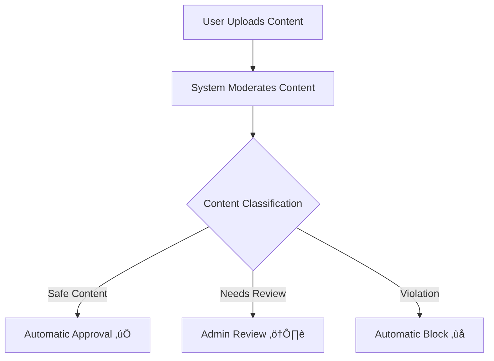
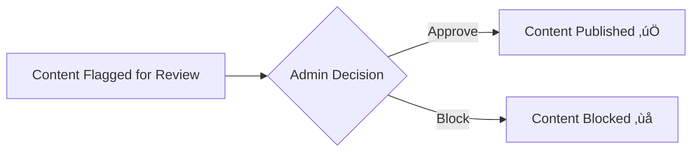
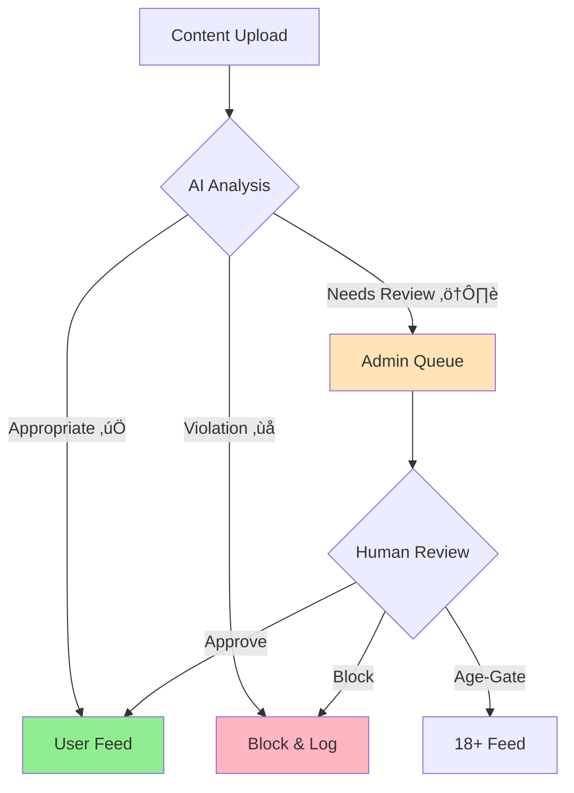

<p align="center">
  
</p>

<div align="center">

[](https://github.com)
[](https://github.com)
[](https://github.com)

# Intelligent Content Moderation for the Digital Age

*Protecting Communities, Empowering Users, Ensuring Trust*

</div>

## 🛡️ Project Overview

KYNSPECTOR is a cutting-edge AI-powered content moderation platform that safeguards digital communities through intelligent content analysis and automated filtering. Our system processes text, images, and videos in real-time, ensuring your platform remains safe, trustworthy, and compliant with community guidelines.

### 🎯 Key Capabilities

<table>
<tr>
<td width="33%">
<h3 align="center">🤖 Smart Detection</h3>
<p align="center">AI-powered analysis of text, images, and videos with contextual understanding</p>
</td>
<td width="33%">
<h3 align="center">⚡ Real-Time Protection</h3>
<p align="center">Instant content filtering and automatic violation detection</p>
</td>
<td width="33%">
<h3 align="center">🌐 Cultural Intelligence</h3>
<p align="center">Multi-language support with focus on Indian regional languages</p>
</td>
</tr>
</table>
<br>

# Installation Guide for KYNSPECTOR

This guide will help you set up and run the Content Moderation System locally using Streamlit.

---

## Prerequisites

Before starting, ensure you have the following installed on your system:

- Python 3.8 or higher
- Git
- pip (Python package manager)
- Virtual environment tool (e.g., `venv` or `virtualenv`) - optional but recommended

---

## Step 1: Clone the Repository

Open your terminal or command prompt and run the following command to clone the repository:

```bash
gh repo clone DL4150/KYNSPECTOR
```


---

## Step 2: Navigate to the Project Directory

```bash
cd KYNSPECTOR
```


---

## Step 3: Create and Activate a Virtual Environment (Optional but Recommended)

### On Windows:
```bash
python -m venv venv
venv\Scripts\activate
```

### On macOS/Linux:
```bash
python3 -m venv venv
source venv/bin/activate
```

---

## Step 4: Install Dependencies

Use the following command to install all required Python packages from `requirements.txt`:

```bash
pip install -r requirements.txt
```

---

## Step 5: Run the Application

Run the Streamlit app using the following command:

```bash
streamlit run admin.py
```

This will start a local web server, and you can access the application in your browser at `http://localhost:8501`.

---

## Step 6: Testing the System

1. Add test data to the `example_data` folder provided in the repository.
2. Interact with the system by uploading content (text, images, or videos) and observe the moderation results.

---

## Troubleshooting

- If you encounter permission issues during installation, try running the commands with `sudo` (Linux/macOS) or as an administrator (Windows).
- Ensure your Python version is 3.8 or higher by running:

```bash
python --version
```

- If any package fails to install, check the error message and try installing the package manually using:

```bash
pip install <package-name>
```

---

## Additional Notes

- Make sure to deactivate the virtual environment when you're done working by running:
  ```bash
  deactivate
  ```
---

<br>

# ⚙️ USAGE INSTRUCTIONS

This manual provides comprehensive instructions for using the KYNSPECTOR content moderation system.

---

## Overview

KYNSPECTOR is designed to support three types of users, each with distinct roles and functionalities:

- **Admin**: Responsible for moderating mildly inappropriate content and fine-tuning the model. 
- **User 1**: A 12-year-old user.
- **User 2**: A 22-year-old user.

All users can interact with the platform through the sidebar and other features accessible from the homepage.

---

## Sidebar Features

The sidebar in KYNSPECTOR provides access to the following user profiles:

### 1. **Admin**
- **Role**: Moderator
- **Capabilities**:
  - Review and moderate mildly inappropriate content flagged by the system.
  - Monitor the **Log** of flagged content and ongoing moderation requests.
  - Fine-tune the model by approving or rejecting flagged content based on appropriateness.

### 2. **User 1**
- **Role**: General User (12 years old)
- **Capabilities**:
  - View posts and make comments on the homepage.
  - Upload videos and photos through the **post** button.
  - Interact with content while adhering to community guidelines.

### 3. **User 2**
- **Role**: General User (22 years old)
- **Capabilities**:
  - Same as User 1 (view, comment, and upload).

---

## Homepage Features

The homepage provides a simple and interactive interface for users to engage with the platform:

1. **Commenting**:
   - Users can leave comments on posts displayed on the homepage.
   - Comments are subject to real-time moderation to filter inappropriate language or content.

2. **Uploading Content**:
   - Users can upload images and videos using the **Upload** button.
   - The uploaded content is automatically analyzed for appropriateness before being displayed.

---

## Admin-Specific Features

The admin user has additional privileges for managing content and moderating flagged items:

1. **Monitoring Log**:
   - View all flagged content, including the confidence scores and moderation outcomes.

2. **Ongoing Requests**:
   - Access a live feed of moderation requests that require manual review.
   - Take actions such as approving or rejecting flagged content to fine-tune the system's AI model.

3. **Fine-Tuning**:
   - Provide input to help improve the AI's moderation accuracy by correcting false positives or negatives.

---

## User Actions Summary

| **Action**            | **User 1 & User 2**                  | **Admin**                                  |
|-----------------------|--------------------------------------|--------------------------------------------|
| Comment on posts      | ✅                                    | ✅                                          |
| Upload images/videos  | ✅                                    | ✅                                          |
| Moderate content      | ❌                                    | ✅                                          |
| View monitoring logs  | ❌                                    | ✅                                          |
| Respond to requests   | ❌                                    | ✅                                          |

---

## Best Practices

- **For Users**:
  - Ensure uploaded content adheres to platform guidelines to avoid unnecessary flagging.
  - Engage respectfully in comments to maintain a positive community atmosphere.

- **For Admins**:
  - Regularly review flagged content to improve the AI's learning process.
  - Use the monitoring log effectively to identify trends in flagged items.

---


## Automated Content Flagging

The system classifies content into three categories using a classification system based on **threshold probabilities**.

### **Categories Based on Confidence Score**:

| **Confidence Score Range** | **Category**          | **Action**                              |
|----------------------------|-----------------------|-----------------------------------------|
| **0.0 to 0.2**             | Safe Content (✅)      | **Automatic Approval**                  |
| **0.2 to 0.4**             | Needs Review (⚠️)     | **Admin Review Required**               |
| **0.4 to 1.0**             | Violation (❌)         | **Automatic Block**                     |

3. Content is **classified** into one of three categories:
   - **Safe Content** (0.0 - 0.2): Automatically approved.
   - **Needs Review** (0.2 - 0.4): Admin reviews and decides.
   - **Violation** (0.4 - 1.0): Automatically blocked.



---

## Admin Role

### **Admin Review Process**
- **Manual Review**:
  Admin is notified to manually review content that falls in the **0.2 to 0.4 range**.  
  Admin decides whether the content should be:
  - **Approved** and published  
  - **Blocked** if it violates guidelines

  **Admin** reviews flagged content in the **0.2 to 0.4 range** and takes appropriate action.



---

## Testing data

- **Demo Folder**:  
  Explicit images and videos are available in the **example_data** folder for testing content moderation and classification.
  
- **Secure Data Entry**:  
  The system ensures **secure entry points** for all uploaded content and user data.

---
<br>

## 🔄 Content Moderation Flow


<div align="center">

### "KYNSPECTOR KEEPING YOUR FEED CLEAN"


</div>

---

## 🔍 Content Classification

<p align="center">
  
</p>

The system classifies content into three categories based on the first and second threshold probabilities. The demo utilizes two threshold values for `n` and `m`, set at **0.2** and **0.4**, respectively.

```
Confidence Score
│
├─── 0.0 to 0.2 ──── Safe Content (✅ Automatic Approval)
│
├─── 0.2 to 0.4 ──── Needs Review (⚠️ Admin Verification)
│
└─── 0.4 to 1.0 ──── Violation (❌ Automatic Block)
```


## Features

- **Multi-Format Content Analysis**: Comprehensive moderation for text, images, and videos
- **Multilingual Support**: Native processing of Indian regional languages
- **Real-Time Comment Filtering**: Instant moderation of user interactions
- **Transparent Monitoring**: Complete audit trail of moderation decisions

## System Architecture


## Content Classification Flow




## 🔄 Content Classification Process

### Content Categories

1. **Appropriate Content (✅)**
   - Direct publication to user feed
   - Automatic approval for compliant content
   - Positive impact on user point system

2. **Mildly Inappropriate Content (⚠️)**
   - Queued for admin review in "Need Action" queue
   - Multiple resolution options available
   - Used for system learning and improvement

3. **Inappropriate Content (❌)**
   - Automatic blocking
   - Logged for audit purposes
   - Zero tolerance for severe violations


