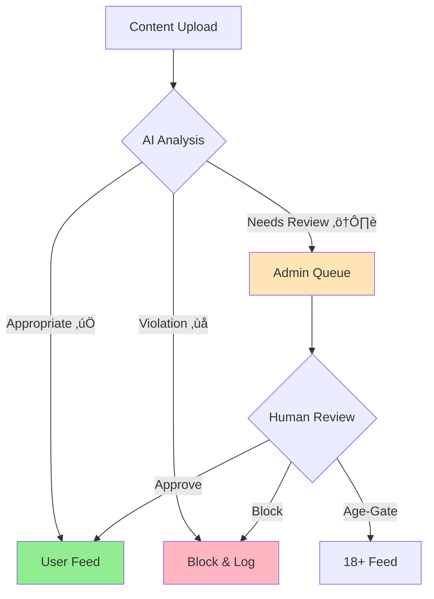

# KYNSPECTOR Content Moderation System

KYNSPECTOR is an intelligent content moderation platform that safeguards online communities through automated detection and management of user-generated content. Our system leverages advanced AI to process text, images, and videos, ensuring a safe and engaging environment for all users.

## Features

- **Multi-Format Content Analysis**: Comprehensive moderation for text, images, and videos
- **Multilingual Support**: Native processing of Indian regional languages
- **Real-Time Comment Filtering**: Instant moderation of user interactions
- **Transparent Monitoring**: Complete audit trail of moderation decisions

## System Architecture

## Content Classification Flow

## 🔄 Content Classification Process

### Content Categories

1. **Appropriate Content (✅)**
   - Direct publication to user feed
   - Automatic approval for compliant content
   - Positive impact on user point system

2. **Mildly Inappropriate Content (⚠️)**
   - Queued for admin review in "Need Action" queue
   - Multiple resolution options available
   - Used for system learning and improvement

3. **Inappropriate Content (❌)**
   - Automatic blocking
   - Logged for audit purposes
   - Zero tolerance for severe violations

