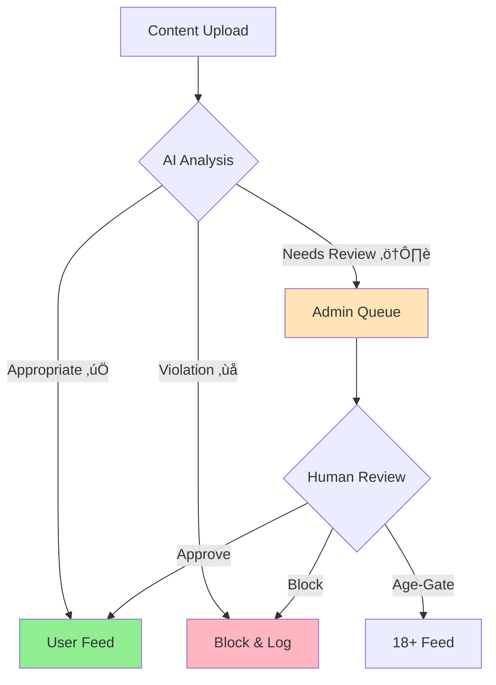

# KYNSPECTOR Content Moderation System

KYNSPECTOR is an intelligent content moderation platform that safeguards online communities through automated detection and management of user-generated content. Our system leverages advanced AI to process text, images, and videos, ensuring a safe and engaging environment for all users.

## 🎯 Core Features

- **Multi-Format Content Analysis**: Comprehensive moderation for text, images, and videos
- **Advanced Deepfake Detection**: State-of-the-art algorithms to identify manipulated media
- **Intelligent User Recognition**: Point-based system rewarding positive community participation
- **Multilingual Support**: Native processing of Indian regional languages
- **Real-Time Comment Filtering**: Instant moderation of user interactions
- **Transparent Monitoring**: Complete audit trail of moderation decisions

## System Architecture


## Content Classification Flow



## User Point System


## Admin Dashboard Components


## Content Processing Pipeline


## 🔄 Content Classification Process

### Content Categories

1. **Appropriate Content (✅)**
   - Direct publication to user feed
   - Automatic approval for compliant content
   - Positive impact on user point system

2. **Likely Inappropriate Content (⚠️)**
   - Queued for admin review in "Need Action" queue
   - Multiple resolution options available
   - Used for system learning and improvement

3. **Very Likely Inappropriate Content (❌)**
   - Automatic blocking
   - Logged for audit purposes
   - Zero tolerance for severe violations

## Monthly Performance Metrics


[Rest of the README content remains the same...]

## 📊 System Performance Overview

```mermaid
gantt
    title Moderation Response Times
    dateFormat  X
    axisFormat %s
    
    section Safe Content
    Automated Review :0, 2s
    Publication     :2s, 3s
    
    section Needs Review
    AI Processing   :0, 2s
    Admin Queue     :2s, 30m
    Final Decision  :30m, 31m
    
    section Violations
    Detection      :0, 1s
    Blocking       :1s, 2s
    Logging        :2s, 3s
```

[Previous content continues...]
